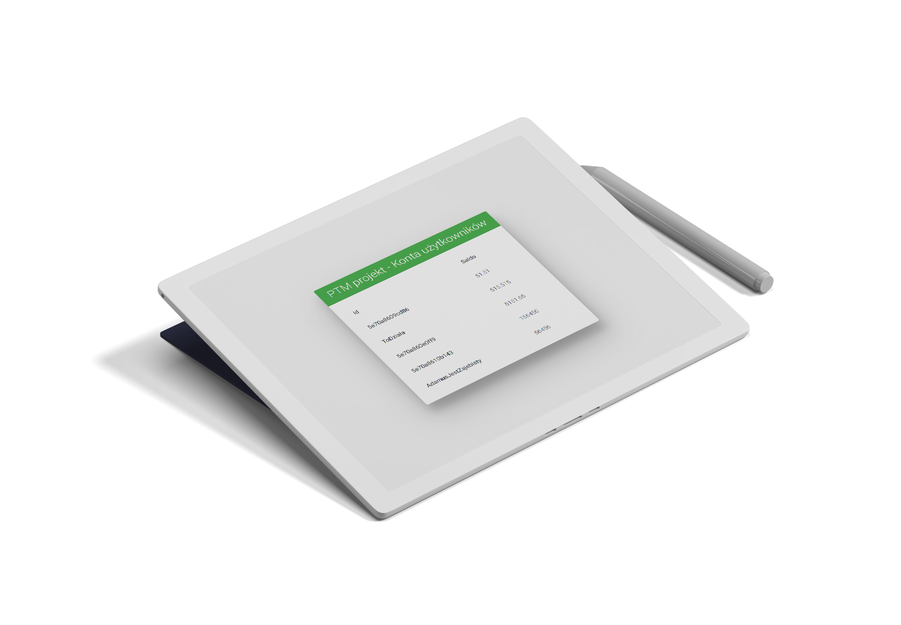

<h1 align="center">
  
   
  Terminal / Bankomat
   
</h1>

<h4 align="center">Wykorzystano STM32, RFID, WiFi </h4>

  <a href="#">Iza Błażejewicz</a> •
  <a href="#">Dominik Adamek</a> •
  <a href="#">Maciej Chajda</a>

## Kluczowa funkcjonalność

### STM
* Doładowanie salda
  - Użytkownik po przyłożeniu karty do terminalu wpisuje na klawiaturze kwotę o jaką jego konto zostanie zasilone.
* Przelew między kontami
  - Wprowadzamy kwotę do przelania między kontami, następnie przykładamy dwie karty, jedna po drugiej, a transakcja zostanie wykonana
  - (Opcjonalnie) wpisujemy numer Id konta na które chcemy przelać kwotę
  
### Cloud
* Interfejs webowy
  - Podgląd kont oraz ich salda
* Storage
  - Przechowuje wszystkie dane związane z kontami
